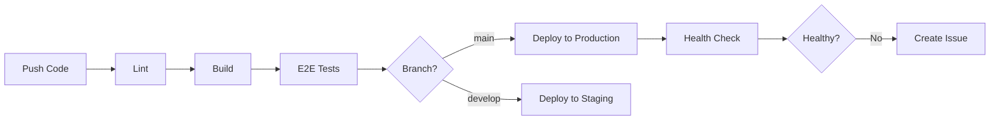

# Quick Start: CI/CD & E2E Testing Setup

This is a quick reference for setting up the CI/CD pipeline and E2E tests for Docket Chief.

## 🚀 Quick Setup Checklist

### 1. Configure GitHub Secrets (5 minutes)

Go to `Settings > Secrets and variables > Actions` and add:

| Secret Name | Where to Get It | Required |
|-------------|----------------|----------|
| `NETLIFY_AUTH_TOKEN` | Netlify > User Settings > Applications > New access token | ✅ Yes |
| `NETLIFY_SITE_ID` | Netlify > Site Settings > General > Site ID | ✅ Yes |
| `VITE_SUPABASE_URL` | Supabase > Project Settings > API > Project URL | ✅ Yes |
| `VITE_SUPABASE_ANON_KEY` | Supabase > Project Settings > API > anon key | ✅ Yes |
| `VITE_APP_NAME` | Use "Docket Chief" | ⚠️ Optional |
| `VITE_PAYMENTS_ENABLED` | Use "false" or "true" | ⚠️ Optional |
| `PRODUCTION_URL` | Use "https://docketchief.com" | ⚠️ Optional |

### 2. Run E2E Tests Locally (3 commands)

```bash
npm install                    # Install dependencies
npx playwright install         # Install test browsers
npm run build && npm run test:e2e  # Build and test
```

### 3. Verify CI/CD (Automatic)

- Push code to `main` or `develop` branch
- Check GitHub Actions tab for workflow status
- CI will automatically: lint → build → test → deploy

## 📚 Documentation

### Main Guides
- **[CI_CD_SETUP.md](CI_CD_SETUP.md)** - Complete CI/CD setup guide with detailed instructions
- **[MONITORING_SETUP.md](MONITORING_SETUP.md)** - Production monitoring and alerting setup
- **[E2E_TESTING.md](E2E_TESTING.md)** - E2E testing guide with examples

### Configuration Files
- **[.github/workflows/ci-cd.yml](.github/workflows/ci-cd.yml)** - GitHub Actions workflow
- **[playwright.config.ts](playwright.config.ts)** - Playwright test configuration
- **[e2e/](e2e/)** - E2E test files

## 🔧 Common Commands

### Development
```bash
npm run dev          # Start dev server
npm run build        # Build for production
npm run preview      # Preview production build
npm run lint         # Run linter
```

### Testing
```bash
npm run test:e2e              # Run E2E tests (headless)
npm run test:e2e:ui           # Run E2E tests (interactive UI)
npm run test:e2e:headed       # Run E2E tests (visible browser)
npm run test:e2e:report       # View test report
```

## 🎯 CI/CD Workflow



## 🔒 Security Notes

- Never commit `.env` files
- Rotate secrets every 90 days
- Use separate keys for dev/prod
- Enable 2FA on all accounts

## 🆘 Troubleshooting

### CI Pipeline Fails
1. Check GitHub Actions logs
2. Verify all secrets are configured
3. Check secret names (case-sensitive)

### E2E Tests Fail Locally
1. Ensure build completed: `npm run build`
2. Check preview server: `npm run preview`
3. Run with visible browser: `npm run test:e2e:headed`

### Deployment Fails
1. Verify Netlify token is valid
2. Check Netlify site ID is correct
3. Review deployment logs in GitHub Actions

## 📞 Getting Help

- Review detailed documentation in `CI_CD_SETUP.md`
- Check Playwright docs: https://playwright.dev/
- GitHub Actions docs: https://docs.github.com/en/actions
- Netlify docs: https://docs.netlify.com/

## ✅ Success Criteria

You'll know it's working when:
- ✅ GitHub Actions workflow runs without errors
- ✅ E2E tests pass locally
- ✅ Deployments succeed automatically
- ✅ Health checks pass after deployment
- ✅ Site is accessible at your domain

## 🎉 What's Included

### CI/CD Pipeline
- ✅ Automated linting (ESLint)
- ✅ Production builds
- ✅ E2E tests (Chromium, Firefox, WebKit, Mobile)
- ✅ Automated deployment to Netlify
- ✅ Post-deployment health checks
- ✅ Automatic issue creation on failures
- ✅ Test reports as artifacts

### E2E Test Coverage
- ✅ Homepage loading and health checks
- ✅ Navigation testing
- ✅ Authentication flow checks
- ✅ Console error detection
- ✅ Network failure detection
- ✅ Multi-browser testing

### Documentation
- ✅ CI/CD setup guide with step-by-step instructions
- ✅ Required secrets documentation
- ✅ E2E testing guide with examples
- ✅ Monitoring and alerting guide
- ✅ Troubleshooting guides
- ✅ Best practices

## 🔮 Next Steps

1. **Configure secrets** (see section 1 above)
2. **Run tests locally** to verify everything works
3. **Push to main/develop** to trigger first CI/CD run
4. **Set up monitoring** (UptimeRobot, Sentry, etc.)
5. **Customize workflow** as needed for your requirements
6. **Add more E2E tests** for critical user flows

---

**Need more details?** See the full documentation:
- [CI/CD Setup Guide](CI_CD_SETUP.md)
- [Monitoring Setup Guide](MONITORING_SETUP.md)  
- [E2E Testing Guide](E2E_TESTING.md)
