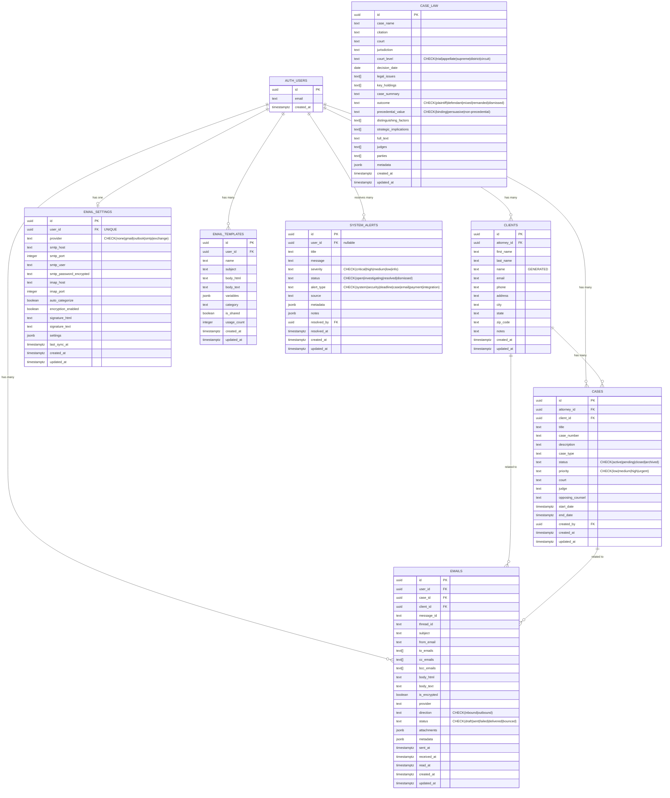
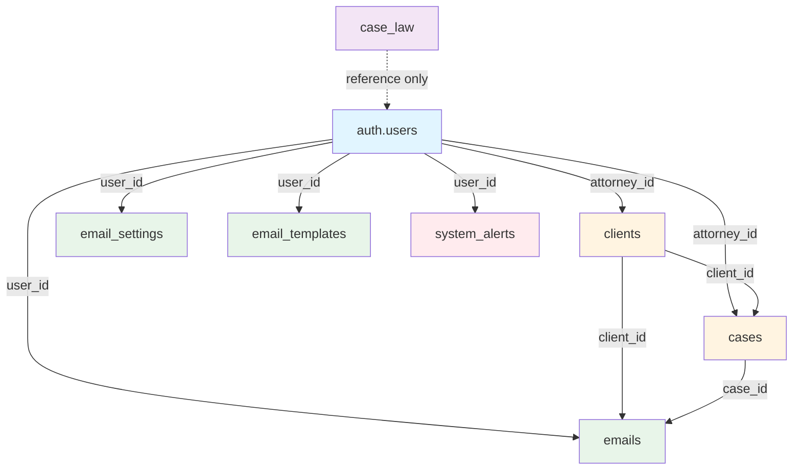
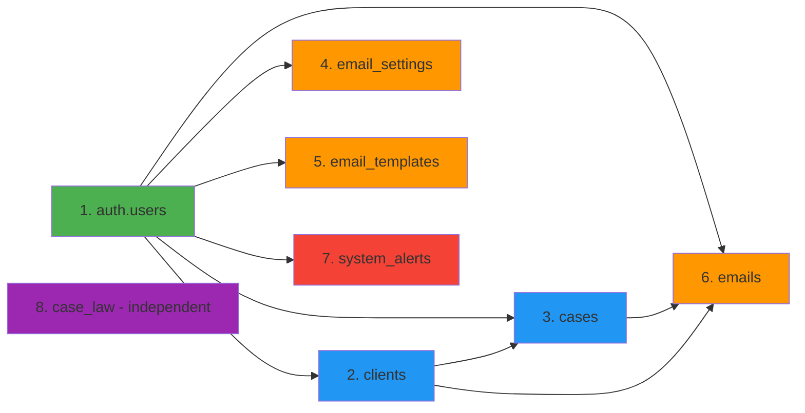
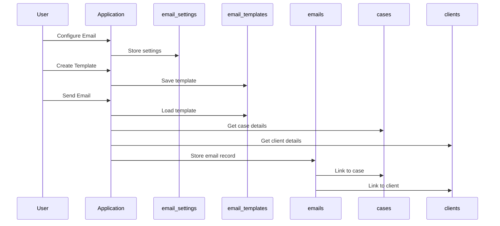
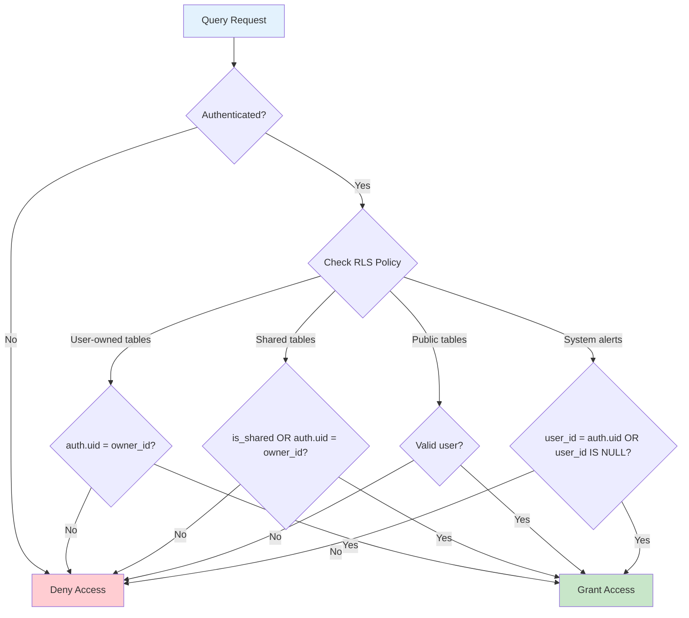
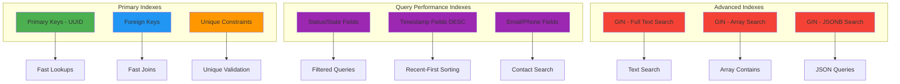

# DocketChief Entity Relationship Diagram (Mermaid)

This file contains the database schema visualization in Mermaid format.

## Full Schema Diagram



## Simplified Core Relationships



## Table Dependency Order (for migrations)



## Data Flow: Email Integration



## RLS Policy Flow



## Index Strategy Visualization



## Usage Examples

### Viewing in GitHub
GitHub automatically renders Mermaid diagrams in markdown files. View this file on GitHub to see the diagrams.

### Viewing Locally
1. Use VS Code with Mermaid extension
2. Use online editor: https://mermaid.live/
3. Use Mermaid CLI: `mmdc -i ER_DIAGRAM_MERMAID.md -o diagram.png`

### Exporting Diagrams
```bash
# Install Mermaid CLI
npm install -g @mermaid-js/mermaid-cli

# Generate PNG
mmdc -i supabase/migrations/ER_DIAGRAM_MERMAID.md -o er-diagram.png

# Generate SVG
mmdc -i supabase/migrations/ER_DIAGRAM_MERMAID.md -o er-diagram.svg -b transparent
```

## References

- [Mermaid Documentation](https://mermaid.js.org/)
- [Entity Relationship Diagrams in Mermaid](https://mermaid.js.org/syntax/entityRelationshipDiagram.html)
- [GitHub Mermaid Support](https://github.blog/2022-02-14-include-diagrams-markdown-files-mermaid/)
